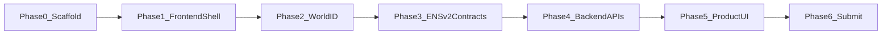

# ContentProof — Implementation Plan

Living document for the ETHGlobal build. Tracks what is done, what comes next, and how backend, frontend, and integrations fit together for the **ENS (ENSv2)** and **World (Selfie Check)** tracks.

---

## Status legend

| Status | Meaning |
|---|---|
| Done | Shipped in the repo |
| Next | Immediate work |
| Planned | Required for demo; not started |
| Out of scope | Explicitly deferred unless requested |

---

## Phase 0 — Project scaffold (Done)

Goal: monorepo-ready Next.js app + Foundry + Postgres index + World feedback skeleton, with stack deps installed but not wired.

### What was implemented

**App shell**
- Next.js 16 (App Router) + TypeScript + Tailwind 4 at repo root
- Metadata set to ContentProof in `app/layout.tsx`
- Default starter page still in `app/page.tsx` (not product UI yet)

**Contracts tooling**
- Foundry project under `contracts/` (`foundry.toml`, `src/`, `test/`, `script/`)
- Solidity `^0.8.24`, sample `Counter` contract so `forge build` / `forge test` work
- `forge-std` available locally (install via `forge install foundry-rs/forge-std` on fresh clones)
- Foundry artifacts ignored (`contracts/cache/`, `out/`, `broadcast/`, `lib/`)
- Foundry intended to run from **WSL** (prebuilt binaries need newer glibc than Ubuntu 20.04; cargo-built `forge` works)

**Dependencies installed (not integrated yet)**
- Wallet / chain: `wagmi` v2, `viem`, `@rainbow-me/rainbowkit`, `@tanstack/react-query`
- World: `@worldcoin/idkit`
- ENS: `@ensdomains/ensjs`
- Hashing: `sharp`, `blockhash-core`
- Index: `prisma` + `@prisma/client` v6

**Off-chain index schema**
- Prisma + **PostgreSQL** (not SQLite)
- Model `ContentIndex`: `subname`, `contentHash`, `ownerAddress`, `timestamp`, `originUrl`, `license`, `revoked`
- Indexes on `contentHash`, `ownerAddress`; unique `subname`
- Initial migration: `prisma/migrations/20260306150000_init_content_index/`
- Scripts: `db:generate`, `db:migrate`, `db:studio`

**Docs / env**
- Product brief: `README.md` (SQLite → PostgreSQL wording updated)
- World track stub: `FEEDBACK.md` (empty section headers)
- `.env.example` with World, Sepolia RPC, deployer key, `DATABASE_URL`, registry address

### Explicitly not done in Phase 0

- No RainbowKit / wagmi providers
- No World ID widget or verify API
- No ENSv2 Permissioned Registry/Resolver contracts
- No perceptual-hash or checker API routes
- No creator dashboard / checker UI

### Exit criteria (met)

- [x] `npm run build` succeeds
- [x] `npx prisma generate` succeeds
- [x] `forge build` + `forge test` succeed in WSL
- [x] `FEEDBACK.md` + `.env.example` present

---

## Phase 1 — Frontend foundation (Done)

Goal: navigable app shell with wallet connect, ready for World ID and ENS calls.

### Deliverables

| Area | Work |
|---|---|
| Providers | Client providers: `wagmi` + RainbowKit + TanStack Query; Sepolia chain config |
| Layout | App chrome: brand, nav (Dashboard / Checker), connect button |
| Pages | `/` landing (short product pitch + CTAs), `/dashboard`, `/checker` stubs |
| Config | `lib/wagmi.ts`, env-driven `NEXT_PUBLIC_SEPOLIA_RPC_URL` / WalletConnect project id if needed |
| UX | Connected address display; empty states when disconnected |

### Files

```
app/layout.tsx
app/providers.tsx
app/page.tsx
app/dashboard/page.tsx
app/checker/page.tsx
lib/wagmi.ts
components/ConnectButton.tsx
components/AppHeader.tsx
```

### Exit criteria

- [x] Connect wallet on Sepolia via RainbowKit
- [x] Routes for landing, dashboard, checker render
- [x] No Privy / MiniKit

---

## Phase 2 — World ID Selfie Check gate (Done — configure Portal credentials)

Goal: registration is blocked until a verified human proof exists (abuse prevention for the World track).

### Backend

| Item | Detail |
|---|---|
| `POST /api/worldid/sign` | Builds RP context via `@worldcoin/idkit/signing` `signRequest` |
| `POST /api/worldid/verify` | Forwards IDKit result to World `POST /api/v4/verify/{rp_id}` (legacy v2 app_id path still accepted) |
| `GET /api/worldid/status` | Reads signed httpOnly verification cookie keyed to wallet |
| Gate flag | `lib/worldid/gate.ts` HMAC cookie (`cp_world_verified`) |

### Frontend

| Item | Detail |
|---|---|
| IDKit widget | `IDKitRequestWidget` + `selfieCheckLegacy` on dashboard |
| Gate UX | “Verify with World ID” before ENS claim controls unlock |
| Sandbox | Set `NEXT_PUBLIC_WORLD_ENVIRONMENT=staging` for simulator / Sandbox App |

### Constraints

- Standalone web app only — **no** `@worldcoin/minikit-js`, not a World Mini App
- Server-side verification mandatory (never trust client-only success)

### Exit criteria

- [x] Unverified wallet cannot unlock registration UI
- [x] Verified flow unlocks creator registration controls (ENS claim still stubbed)
- [ ] `FEEDBACK.md` filled with Portal / docs / Sandbox notes (fill while testing)

### Required env (Phase 2)

```
NEXT_PUBLIC_WORLD_APP_ID=
NEXT_PUBLIC_WORLD_RP_ID=
NEXT_PUBLIC_WORLD_ENVIRONMENT=staging
WORLD_RP_SIGNING_KEY=
WORLD_APP_SECRET=
NEXT_PUBLIC_WALLETCONNECT_PROJECT_ID=
NEXT_PUBLIC_SEPOLIA_RPC_URL=
```

---

## Phase 3 — ENSv2 contracts (Next / Planned)

Goal: Permissioned Registry + Permissioned Resolver + Enhanced Access Control on Sepolia — do **not** reimplement registry/resolver from scratch.

### Contracts work

1. Pull / configure official ENSv2 Permissioned Registry & Permissioned Resolver
2. Root name under operator control (e.g. `contentproof.eth` testname on Sepolia)
3. Creator subname mint: `alice.contentproof.eth`
4. Content subname: `post-<hash>.alice.contentproof.eth`
5. Resolver text records: `contentHash`, `timestamp`, `originUrl`, `license` (and revoke flag as needed)
6. Enhanced Access Control: non-transferable content claims; revoke only by original registrant
7. Foundry tests **before** Sepolia deploy (registry, resolver records, access control, revoke)

### Scripts / deploy

- Foundry deploy script for Sepolia
- Write addresses into `.env` / README table (`CONTENTPROOF_REGISTRY_ADDRESS`, resolver)

### Exit criteria

- [ ] Tests cover register / duplicate policy hooks / revoke / non-transfer
- [ ] Live Sepolia addresses documented in README
- [ ] README explains why ENSv2 hierarchy (parent resolver / subnames) matters

---

## Phase 4 — Backend services (Planned)

Goal: Next.js route handlers only (no Express). On-chain remains source of truth; Prisma is a rebuildable cache.

### Modules

```
lib/hashing/          # sharp preprocess + blockhash-core perceptual hash
lib/detection/        # Hamming-distance match against ContentIndex
lib/worldid/          # verify helper used by API
lib/ens/              # ensjs or raw viem calls to Permissioned Registry/Resolver
lib/db.ts             # Prisma client singleton
app/api/...
```

### API routes

| Route | Role |
|---|---|
| `POST /api/worldid/verify` | Selfie Check proof verification (Phase 2) |
| `POST /api/hash` | Accept image upload or fetch URL → return perceptual hash |
| `POST /api/check` | Hash input → query `ContentIndex` → match / no-match + owner ENS + timestamp |
| `POST /api/register` | Gate on World proof → reject if near-duplicate → write on-chain + upsert index |
| `POST /api/revoke` | Only original registrant; update resolver + set `revoked` in index |
| `POST /api/index/sync` (optional) | Rebuild cache from chain for a subname / owner |

### Detection rules

- Compare perceptual hashes with a threshold (near-match = duplicate)
- Exact or near match → reject registration; checker returns existing claim
- Revoked rows excluded from “active claim” matches (or surfaced as revoked)

### Exit criteria

- [ ] Checker API returns owner + timestamp on match
- [ ] Register API rejects duplicates and unverified users
- [ ] Index rows mirror successful on-chain writes

---

## Phase 5 — Frontend product flows (Planned)

Goal: end-to-end demo UI for creator + public checker.

### Creator dashboard (`/dashboard`)

1. Connect wallet  
2. Complete World ID Selfie Check  
3. Register / view ENS creator subname  
4. Upload image (or paste origin URL) + license terms  
5. Submit registration (hash → duplicate check → tx)  
6. List owned claims; revoke fraudulent / mistaken claims  

### Public checker (`/checker`)

1. Paste image upload or URL  
2. Show match / no match  
3. On match: ENS name, timestamp, origin, license, revoked status  

### Integration wiring

| Integration | Frontend touchpoint |
|---|---|
| RainbowKit | Header connect |
| World IDKit | Dashboard gate |
| wagmi/viem / ensjs | Subname register, resolver reads/writes, revoke txs |
| API routes | Hash, check, register orchestration |

### Exit criteria

- [ ] Demo path: verify → register content → checker finds it  
- [ ] Demo path: second wallet / copy attempt flagged and rejected  
- [ ] Original creator can revoke  

---

## Phase 6 — Integration hardening & submission (Planned)

Goal: sponsor-ready demo and docs.

### ENS track

- [ ] Functional on ENSv2 Sepolia (no hardcoded fake registry behavior)
- [ ] README points at Permissioned Registry/Resolver addresses + hierarchy rationale
- [ ] 2–4 min demo video: duplicate registration caught
- [ ] Public repo

### World track

- [ ] Selfie Check is a real registration gate (not cosmetic)
- [ ] Tested with World ID Sandbox App
- [ ] `FEEDBACK.md` complete (docs, Developer Portal, Sandbox errors, confusion, suggestions)
- [ ] Working demo

### Ops

- [ ] Vercel deploy (app + API)
- [ ] Alchemy/Infura Sepolia RPC
- [ ] Postgres hosted (Neon / Supabase / Vercel Postgres)
- [ ] Granular commits throughout (avoid single end-of-project commit)

---

## Suggested build order (9-day hackathon)



Parallelism tip: after Phase 1, contract research/tests (Phase 3) can overlap with World ID wiring (Phase 2) if one person splits time carefully. Do **not** skip Foundry tests before Sepolia deploy.

---

## Current repo map

```
content_proof/
├── README.md                 # product + track brief
├── IMPLEMENTATION.md         # this file
├── FEEDBACK.md               # World feedback (fill during Phase 2/6)
├── .env.example
├── app/                      # Next.js App Router (UI + future API routes)
├── contracts/                # Foundry (Counter placeholder until Phase 3)
├── prisma/                   # PostgreSQL ContentIndex schema + migration
└── package.json              # stack deps installed
```

Conceptual layout from the brief maps to:

| Brief folder | Actual location |
|---|---|
| `frontend/dashboard` | `app/dashboard/` |
| `frontend/checker` | `app/checker/` |
| `backend/hashing` | `lib/hashing/` + `app/api/hash` |
| `backend/detection` | `lib/detection/` + `app/api/check` |
| `backend/worldid` | `lib/worldid/` + `app/api/worldid/verify` |

---

## Out of scope (unless explicitly requested)

- Other sponsor SDKs (Chainlink, Privy, The Graph, Ledger, Hedera, Arc, etc.)
- World Mini App / MiniKit
- Broad feature surface beyond the demo path (notifications, multi-media types beyond images, complex licensing marketplace, etc.)

---

## Next action

**Start Phase 3:** ENSv2 Permissioned Registry / Resolver research + Foundry tests (before Sepolia deploy). Fill `FEEDBACK.md` while testing World ID Sandbox against Phase 2.
